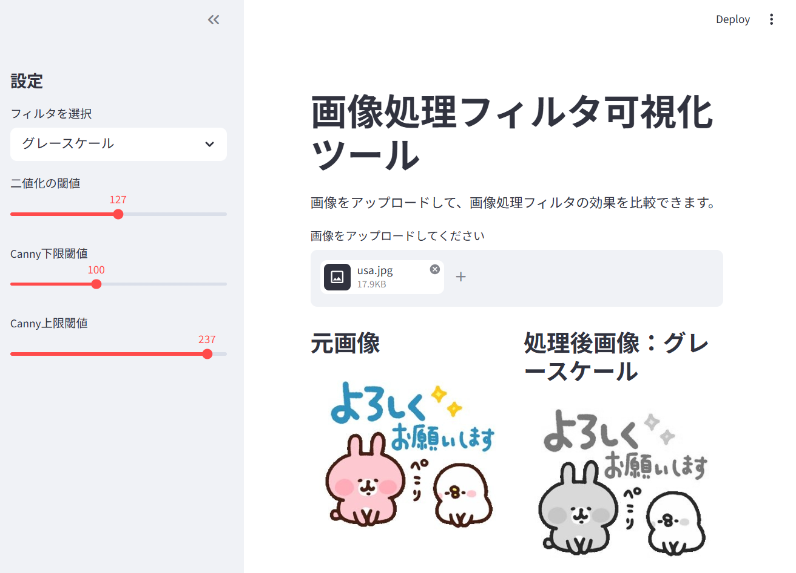
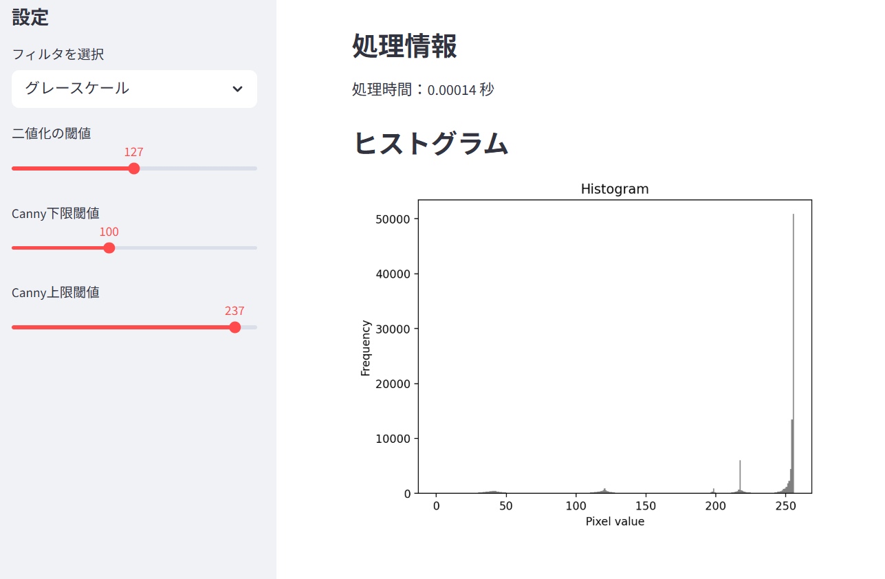

# 画像処理フィルタ可視化ツール

## 概要

StreamlitとOpenCVを用いて、画像処理フィルタの効果をブラウザ上で確認できるWebアプリです。

画像をアップロードすると、選択したフィルタを適用し、元画像と処理後画像を並べて比較できます。  
また、処理時間も表示することで、画像処理の結果だけでなく処理速度も確認できます。

## 使用技術

- Python
- Streamlit
- OpenCV
- NumPy
- Matplotlib
- Pillow

## 主な機能

- 画像アップロード機能
- 元画像と処理後画像の比較表示
- グレースケール変換
- 二値化
- ガウシアンぼかし
- メディアンフィルタ
- Sobelエッジ検出
- Laplacianエッジ検出
- Cannyエッジ検出
- シャープ化
- 処理時間の表示
- ヒストグラムの表示

## スクリーンショット

## 工夫した点

- Streamlitを使用し、ブラウザ上で簡単に操作できるUIを作成しました。
- 複数の画像処理フィルタを選択式にし、効果を比較しやすくしました。
- 元画像と処理後画像を横並びで表示し、変化が分かりやすい構成にしました。
- 処理時間を表示することで、各フィルタの処理負荷を確認できるようにしました。
- 二値化やCannyエッジ検出では、しきい値をスライダーで調整できるようにしました。

## 実行結果

アップロードした画像に対して、グレースケール化、二値化、ぼかし、エッジ検出、シャープ化などの処理を適用できました。

元画像と処理後画像を並べて表示することで、各フィルタの違いを視覚的に確認できるアプリを作成できました。

## 学んだこと

- Streamlitを使ったWebアプリの作成方法
- OpenCVを用いた基本的な画像処理
- 画像の色空間変換
- 二値化やエッジ検出などの画像処理アルゴリズム
- Pythonライブラリを組み合わせたアプリ開発
- READMEによる成果物の説明方法

## 今後の改善案

- 処理後画像のダウンロード機能を追加する
- 複数のフィルタを同時に比較できるようにする
- フィルタの強度をより細かく調整できるようにする
- アップロードできる画像形式を増やす
- UIデザインをさらに見やすく改善する

## 実行方法

## 実行方法  

1. リポジトリをクローンします。  

`git clone https://github.com/saki-nya1539/image-filter-visualizer.git`  

2. フォルダに移動します。  

`cd image-filter-visualizer`  

3. 必要なライブラリをインストールします。  

`pip install streamlit opencv-python numpy matplotlib pillow`  

4. アプリを起動します。  

`streamlit run app.py` 

## リポジトリURL

本プロジェクトのGitHubリポジトリは以下です。

https://github.com/saki-nya1539/image-filter-visualizer